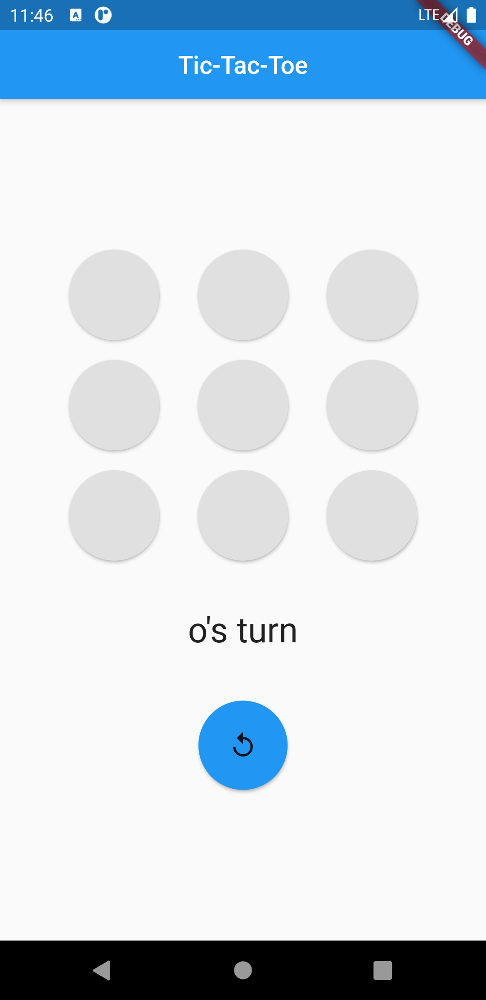
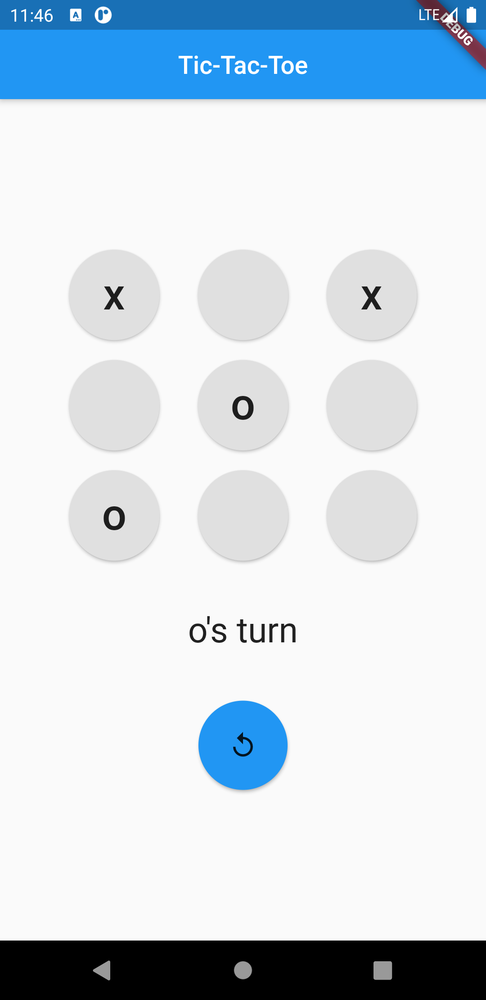
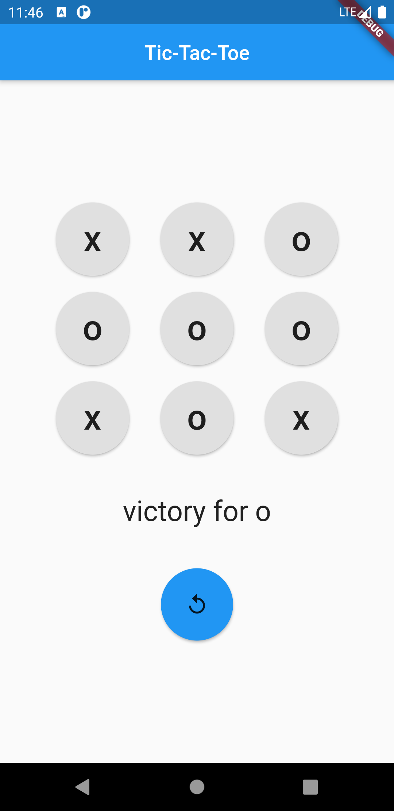

# Tic-Tac-Toe Demos

### simple tic tac toe game(s) to be played in the terminal 

I feel that a little terminal game is a great first project when exploring a new language. So as I was self teaching **python** and **c++** I made some games as a way of learning the basics.

---

### Simple tic tac toe app

as I was learning **flutter & dart** I decided to do the same by making a simple application for tic tac toe

here are some screen shots from the app

